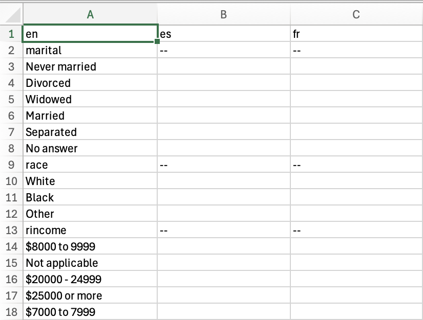
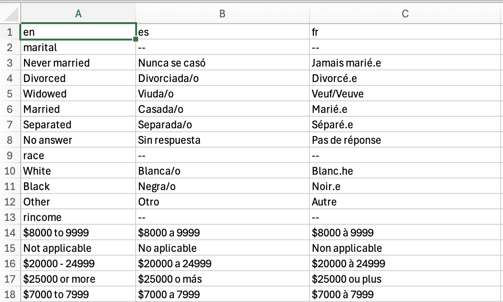

```{r, include = FALSE}
knitr::opts_chunk$set(
  collapse = TRUE,
  comment = "#>"
)
```

```{r setup}
library(transcats)
```

The `transcats` package is designed to make it easy to translated categorical, tabular data (and other data with repeated values) between multiple languages.

## Set-Up

For this example, we'll create a translation table for the variables in `gss_cat`, a data table from the General Social Survey that is include in the package `forcats`. Here's a look at gss_cat:

```{r show-gss_cat}
library(forcats) # loads gss_cat

forcats::gss_cat
```

Numerical variables—`year`, `age`, and `tvhours` don't need a translation, but factor-based variables do. **(Be careful!** Some text variables, like names, geographic locations, and organizations, might not need to be translated, depending on the context and languages involved.) This code creates a short list of those variable names:

```{r select-variables-to-translate}         
# select names of all of the factor and character variables
# in gss_cat
gss_cat %>% dplyr::select(where(~ is.factor(.x) || is.character(.x))) %>%
  names() -> gss_cat_trans_variables
gss_cat %>% dplyr::select(where(~ is.numeric(.x))) %>%
  names() -> gss_cat_num_variables

gss_cat_trans_variables
```

To work on this with `transcats`, we set the source language to English and name destination languages using `set_source_lang` and `set_dest_lang_list`, choosing Spanish and French. Note that these language codes are two-letter shortcodes by convention, not requirement. Just work to be consistent across a project. You may also use longer language codes, or modify language codes to indicate variations. The package uses `r_variable` as a language code to designate variable names.

```{r set-langs}
set_source_lang("en")
set_dest_lang_list(c("es", "fr"))
```

## Creating a translation table

Translation in `transcats` is done with manually created or verified translation tables for each possible value of the variable in question. The function `create_blank_translation_table` creates a table for one variable:

```{r blank-translation-table}
marital_trans_table <- create_blank_translation_table(gss_cat, "marital")
marital_trans_table
```
The slightly differently named `create_blank_translation_tables` (with a final **s**) creates a cluster of such tables, given a list of variables. By default, this merges the tables into one long dataframe that can be exported for translation by hand.

```{r combined-blank-table, R.options=list(max.print=40)}
gss_translation_combined <- create_blank_translation_tables(gss_cat,
                                                            gss_cat_trans_variables)
gss_translation_combined
```

With different preferences, this table can be put directly in the `transcats` preferred translation table-list format. (But the blank entries mean this won't work for translation.)

```{r listed-blank-tables, R.options=list(max.print=25)}
gss_translation <- create_blank_translation_tables(gss_cat, gss_cat_trans_variables, combine_tables = FALSE)
gss_translation 
```

### Editing the translation table externally

Now we can write the combined table into an external file, available for editing via an external text editor or spreadsheet program.
```{r save-to-file}
do_not_run <- TRUE

if(!do_not_run){
readr::write_excel_csv(
  gss_translation_combined,
  "inst/extdata/gss_cat_transtable.csv")
}
```

Editing by hand, or using machine translation and then editing the results, we fill in the table.

{ width=38% } { width=55% }

The completed .csv can be imported back into R. Use `parse_combined_translation_table` to turn the combined list into a `transcats` list of translation tables.

```{r reload-translation-table}
library(fs)

gss_translation_combined <- 
  readr::read_csv(fs::path_package("extdata", "gss_cat_transtable_complete.csv",
                                         package = "transcats"))
gss_translation <- parse_combined_translation_table(gss_translation_combined)
gss_translation
```

The imported translation table is now available to do data translation using `translated_join_vars`.

## Translating categorical data

```{r translated-dataframe}
set_active_translation_table(gss_translation)
set_source_lang("en")
set_dest_lang("fr")
gss_cat_2 <- translated_join_vars(gss_cat, gss_cat_trans_variables)

gss_cat_fr <- gss_cat_2 %>% dplyr::select(-all_of(gss_cat_trans_variables))

# reorder to match original
gss_cat_fr <- gss_cat_fr %>% dplyr::relocate(age, .after="marital_fr") %>%
                             dplyr::relocate(tvhours, .after="denom_fr")

# gss_cat_fr_variables <- g
```

Let's compare the input and and output:

```{r display-translated-dataframe}
knitr::kable(head(gss_cat, 12))
knitr::kable(head(gss_cat_fr, 12))
```
